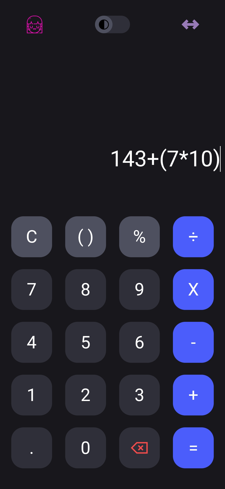
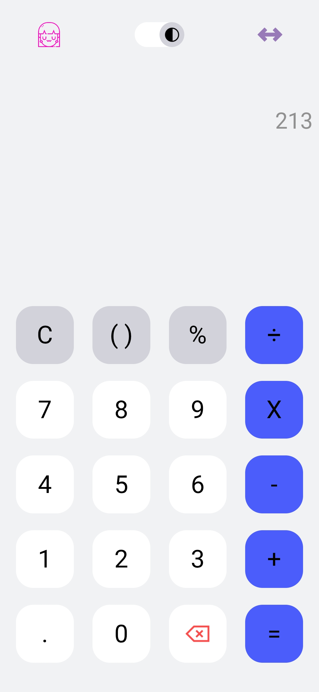

# UWU Calculator

Playful, minimal calculator with light/dark themes, fullscreen, and a tiny UWU sound. Pure HTML, CSS, and JS.

## Live demo
- Live: https://theniteshnagar.github.io/uwu-calculator-html-css-js/
- Preview: 

## Screenshots

## What you get
- Light/dark toggle with saved preference (localStorage).
- Fullscreen for distraction-free calculations.
- UWU button with a short sound cue.
- Cursor-aware input so you can edit mid-expression.
- Click the result panel to reuse the last answer.

Thanks for checking it out! ❤️
